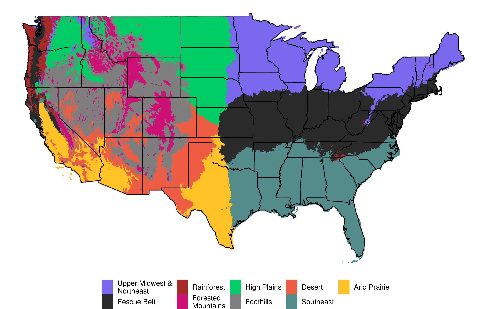

This analysis builds on work from [Rowan et al. 2020: Powerful detection of polygenic selection and environmental adaptation in U.S. beef cattle](https://www.biorxiv.org/content/10.1101/2020.03.11.988121v3)

Here we have increased our sample sizes to well over 100,000 animals in both Simmental and Red Angus datasets. We also impute sequence-level genotypes from Run 8 of the 1K Bulls Project (> 40 million SNPs)

